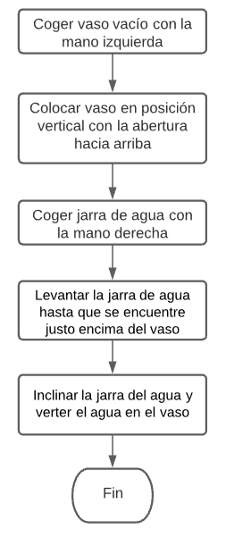
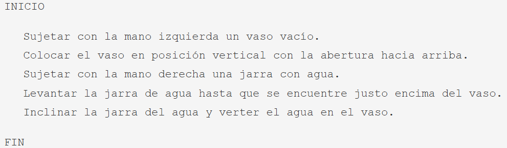

# Diseño

Después de analizar en detalle el problema a solucionar, hemos de diseñar y desarrollar el algoritmo adecuado. Pero, **¿Qué es un algoritmo?**

Algoritmo: secuencia ordenada de pasos, descrita sin ambigüedades, que conducen a la solución de un problema dado.

Los algoritmos son independientes de los lenguajes de programación y de las computadoras donde se ejecutan. Un mismo algoritmo puede ser expresado en diferentes lenguajes de programación y podría ser ejecutado en diferentes dispositivos. Piensa en una receta de cocina, esta puede ser expresada en castellano, inglés o francés, podría ser cocinada en fogón o vitrocerámica, por un cocinero o más, etc. Pero independientemente de todas estas circunstancias, el plato se preparará siguiendo los mismos pasos.

La diferencia fundamental entre **algoritmo** y **programa** es que, en el segundo, los pasos que permiten resolver el problema, deben escribirse en un determinado lenguaje de programación para que puedan ser ejecutados en el ordenador y así obtener la solución.

Los **lenguajes de programación** son solo un medio para expresar el algoritmo y el ordenador un procesador para ejecutarlo. El diseño de los algoritmos será una tarea que necesitará de la creatividad y conocimientos de las técnicas de programación. Estilos distintos, de distintos programadores a la hora de obtener la solución del problema, darán lugar a algoritmos diferentes, igualmente válidos.

En esencia, todo problema se puede describir por medio de un algoritmo y las características fundamentales que estos deben cumplir, son:

- Debe ser preciso e indicar el orden de realización paso a paso.
- Debe estar definido, si se ejecuta dos o más veces, debe obtener el mismo resultado cada vez.
- Debe ser finito, debe tener un número finito de pasos.

Pero cuando los problemas son complejos, es necesario descomponer estos en subproblemas más simples y, a su vez, en otros más pequeños.

La descomposición del problema original en subproblemas más simples y a continuación dividir estos subproblemas en otros más simples que pueden ser implementados para su solución en el ordenador se denomina diseño descendente (top-down design). Las ventajas más importantes del diseño descendente son:

- El problema se comprende más fácilmente al dividirse en partes más simples denominadas módulos.
- Las modificaciones en los módulos son más fáciles. 
- La comprobación del problema se puede verificar fácilmente.

Hay que tener en cuenta que antes de pasar a la implementación del algoritmo, hemos de asegurarnos que tenemos una solución adecuada. Para ello, todo diseño requerirá de la realización de la **prueba o traza del programa**. Este proceso consistirá en un seguimiento paso a paso de las instrucciones del algoritmo utilizando datos concretos. Si la solución aportada tiene errores, tendremos que volver a la fase de análisis para realizar las modificaciones necesarias o tomar un nuevo camino para la solución. Solo cuando el algoritmo cumpla los requisitos y objetivos especificados en la fase de análisis se pasará a la fase de implementación.

Para representar gráficamente los algoritmos que vamos a diseñar, tenemos a nuestra disposición diferentes herramientas que ayudarán a describir su comportamiento de una forma precisa y genérica, para luego poder codificarlos con el lenguaje que nos interese. Entre otras tenemos:

- **Diagramas** de flujo: Esta técnica utiliza símbolos gráficos para la representación del algoritmo. Suele utilizarse en las fases de análisis.
- **Pseudocódigo**: Esta técnica se basa en el uso de palabras clave en lenguaje natural, constantes (Estructura de datos que se utiliza en los lenguajes de programación que no puede cambiar su contenido en el transcurso del programa.), variables (Estructura de datos que, como su nombre indica, puede cambiar de contenido a lo largo de la ejecución de un programa.), otros objetos, instrucciones y estructuras de programación que expresan de forma escrita la solución del problema. Es la técnica más utilizada actualmente.
- **Tablas de decisión**: En una tabla son representadas las posibles condiciones del problema con sus respectivas acciones. Suele ser una técnica de apoyo al pseudocódigo cuando existen situaciones condicionales complejas.

## Ejemplos:

- Algoritmo de cómo llenar un vaso de agua [(según la versión de los humoristas Tip y Coll)](https://youtu.be/SewKscT5tiM)
- **Descripción en lenguaje natural**: Debemos sujetar con una mano un vaso vacío en posición vertical con la abertura hacia arriba y con la otra mano una jarra con agua. Ubicaremos la jarra de agua en un plano superior al del vaso y la inclinaremos haciendo coincidir el chorro de agua con la abertura del vaso.
- **Diagrama de flujo**: 
   
* Pseudocódigo:
   