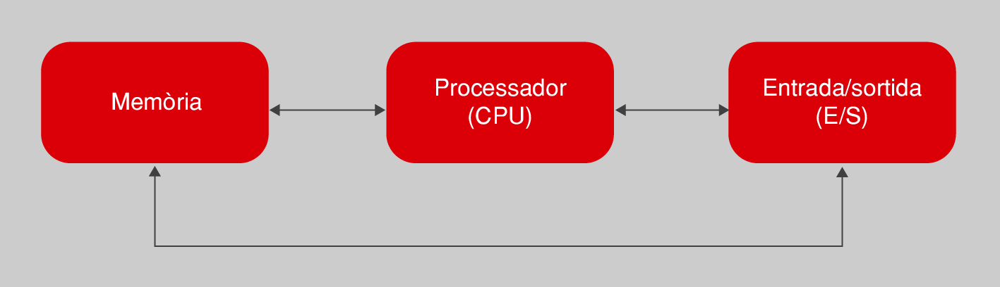

# Tipo de órdenes que acepta un ordenador

Para llevar a cabo la tarea encomendada, un ordenador puede aceptar diferentes tipos de órdenes. Estas se encuentran limitadas a las capacidades de los componentes que lo conforman, del mismo modo que el programa de una lavadora no puede incluir la orden de gratinar, puesto que no tiene gratinador. Por lo tanto, es importante tener presente este hecho para saber que se puede pedir al ordenador cuando creáis un programa.

La estructura interna del ordenador se divide en una serie de componentes, todos comunicados entre sí, tal como muestra la figura de manera muy simplista, pero suficiente para empezar. Cada orden de un programa está vinculada de una manera u otra a alguno de estos componentes.

El procesador también es conocido popularmente por sus siglas en inglés: CPU (central processing unit, unidad central de procesamiento).

El **procesador** es el centro neurálgico del ordenador y el elemento que es capaz de llevar a cabo las órdenes de manipulación y transformación de los datos. Un conjunto de datos se puede transformar de muchas maneras, según las capacidades que ofrezca cada procesador. Aun así, hay muchas transformaciones que todos pueden hacer. Un ejemplo es la realización de operaciones aritméticas (suma, resto, multiplicación, división), tal como hacen las calculadoras.

La **memoria** permite almacenar datos mientras estos no están siendo directamente manipulados por el procesador. Cualquier dato que tiene que ser tratado por un programa estará en la memoria. Mediante el programa se puede ordenar al procesador que guarde ciertos datos o que los recupere en cualquier momento. Normalmente, cuando se habla de memoria a este nivel nos referimos a memoria dinámica o RAM (random access memory, memoria de acceso aleatorio). Esta memoria no es persistente y una vez acaba la ejecución del programa todos los datos con los cuales trataba se desvanecen. Por lo tanto, la información no se guardará entre sucesivas ejecuciones diferentes de un mismo programa.

En ciertos contextos es posible que nos encontremos también con memoria ROM (read-only memory, memoria solo de lectura). En esta, los datos están predefinidos de fábrica y no se puede almacenar nada, solo podemos leer lo que contiene. Hay que decir que no es el caso más habitual.

El **sistema de entrada/salida** (abreviado como E/S) permite el intercambio de datos con el exterior del ordenador, más allá del procesador y la memoria. Esto permite traducir la información procesada en acciones de control sobre cualquier periférico conectado al ordenador. Un ejemplo típico es establecer una vía de diálogo con el usuario, ya sea por medio del teclado o del ratón para pedirle información, como por la pantalla, para mostrar los resultados del programa. Este sistema es clave para convertir un ordenador en una herramienta de propósito general, puesto que lo capacita para controlar todo tipo de aparatos diseñados para conectarse.

Otra posibilidad importante del ordenador, atendidas las limitaciones del sistema de memoria, es poder interactuar con el hardware de almacenamiento persistente de datos, como un disco duro.

Partiendo de esta descripción de las tareas que puede llevar a cabo un ordenador según los elementos que lo componen, un ejemplo de programa para multiplicar dos números es el mostrado a la tabla.1. Lo tenéis expresado en lenguaje natural. Notar como los datos tienen que estar siempre almacenadas a la memoria para poder operar.

## Un programa que multiplica dos números usando lenguaje natural

| Orden para dar | Elemento que lo efectúa |
|--------------------------------------| ------ |
| 1. Lee un número del teclado. | E/S (teclado) |
| 2. Guarda el número a la memoria. | Memoria |
| 3. Lee otro número del teclado. | E/S (teclado) |
| 4. Guarda el número a la memoria. | Memoria |
| 5. Recupera los números de la memoria y haz la multiplicación. | Procesador |
| 6. Guarda el resultado a la memoria. | Memoria |
| 7. Muestra el resultado a la pantalla. | 	E/S (pantalla) |