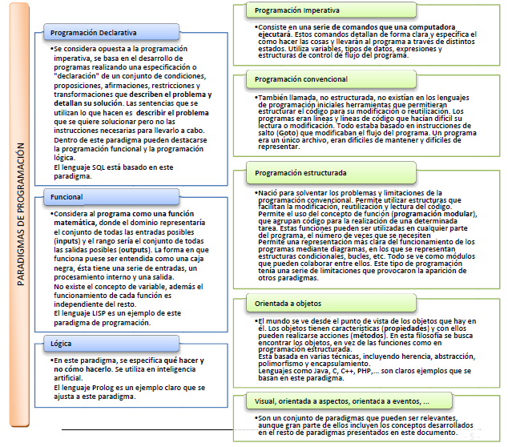

# Paradigmas de la programación

¿Cuántas formas existen de hacer las cosas? Muchas. Pero cuando se establece un patrón para la creación de aplicaciones nos estamos acercando al significado de la palabra paradigma.

Paradigma de programación: es un modelo básico para el diseño y la implementación de programas. Este modelo determinará como será el proceso de diseño y la estructura final del programa.

El paradigma representa un enfoque particular o filosofía para la construcción de software. Cada uno tendrá sus ventajas e inconvenientes, será más o menos apropiado, pero no es correcto decir que exista uno mejor que los demás.

